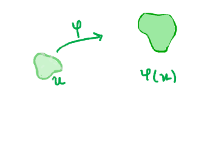
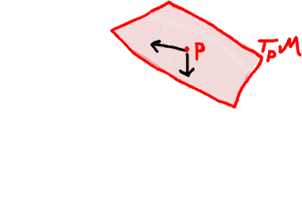
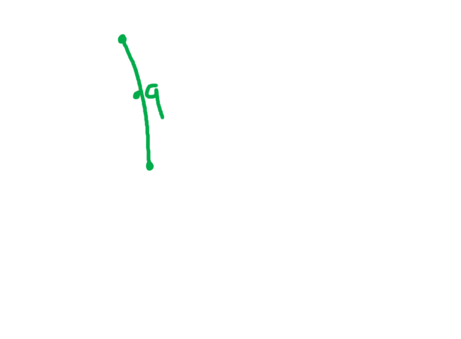

# Preliminary notions

## Manifolds

Before anything, it is important to recall the definition of a **manifold**.\
A manifold $(\mathcal{M}, T, \mathcal{A})$ of dimension $n$ corresponds to a **topological space** all together with a **set of charts** called *atlas* and denoted by $\mathcal{A} = (\mathcal{U}, \varphi)$, that can individually be continuously be mapped into an open subspace of $\mathbb{R}^n$ (respectively, this subspace can be mapped back into the original set i.e. we have a **homeomorphism** $\varphi$ from $\mathcal{U}$ to $\mathbb{R}^n$).\
In other words, a manifold is a topological space that locally resembles to the euclidian space in a tightened neighborhood (e.g. the Earth is a spherical surface, but may have local flattened representations).

When we talk of charts, preciseley, we are talking of a neighborhood of a point, with a fixed size. The union of all of the charts form the atlas $\mathcal{A}$, and corresponds exactly to the original manifold $\mathcal{M}$. In the case a point is included in two differents charts (i.e. the intersection of two charts is non null), we can define what we call a *transition function*, or a *transition map* from the image of the intersection of the two charts with respects to $\varphi_\alpha$, to the image of this intersection wrt $\varphi_\beta$. More precisely, this transition map is defined on the composition of one chart and the inverse of the other : $\tau_{\alpha, \beta} = \varphi_\beta \circ \varphi_\alpha^{-1}$. Being a composition of two homeomorphisms, the transition map is also a homeomorphism.

## Tangent Space

Considering a manifold $\mathcal{M}$ of dimension $d$, we begin by chosing a point $p \in \mathcal{M}$. Now, let's consider the set of all smooth curves in $\mathcal{M}$ that passes through $p$ denoted by  $\mathcal{C}_p^\infty(\mathcal{M})$. Since each curve is paratrized, we can take the parameter derivative which produces the velocity at each point. To produce the tangeant vectors at a point, we need to take the derivative of all of the smooth curves at this point. The tangeant space $T_pM$ is a vector space of the same dimension as the manifold.\
From this, we define the ***tangent bundle*** TM of a manifold, which corresponds to the sum of every tangent spaces at each point of the manifold. Each element of $TM$ is a couple $(x, v)$ where $x$ is a point in $\mathcal{M}$ and $v$ is a tangent vector of $\mathcal{M}$ at $x$.

## Riemanian manifold

We can now introduce the notion of Riemanian manifold :

A Riemanian manifold is a differentiable manifold together with a given Riemanian metric. 
A Riemannian metric (p 38) on a manifold associates to each point of M an inner product $\Phi$ on the tengeant space on that point. The whole point of using Riemannian manifolds is that as the tangeant space at each point is a Euclidean space with a defined inner product, this enables us  to defines a lot of notions on the manifold like distance, length, angles and curvature. The notion of angle between two curves for example, can be defined as the angle between their tangent vectors at their intersection point. We can also for example define the notion of length of a curve based on the integral of the inner product of its tangent vectors at each point [2] : 
$$\mathcal{L} = \int_a^b\sqrt{\Phi(\frac{dp}{dt}, \frac{dp}{dt})}dt$$

When we say that the manifold should be differentiable, we could equivalently say that the manifold should be smooth so the calculus rules applies.

The notion of tangent space on a point is based on the notion of tangent  vectors, representing the velocity of any curve passing through that point.

## Geodesics

Geodesics are one of the fundamental concepts of Riemanian geometry. Simply said, a geodesic genelalizes the notion of a straight line in the euclidian space to manifolds, and locally yields the shortest distance between two points. In addition, the shortest path between two points in general is always a geodesic.\
One thing to know is that a curve living on a manifold has not only one but many derivatives, as it may bend along multiple directions. Hence, we introduce the notion of ***covariant derivative***, which - simply said - shall recall the derivative of a tengeant vector $V$ *from the viewpoint of $S$*. The major point for a curve to be geodesic is that it should be parametrized with constant speed, in other words, its covariant derivative should always be equal to zero.

## Exponential maps

On a manifold $\mathcal{M}$, we define the notion of *exponential map* $\exp()$ as a map from a subset of a tangent space $T_pM$ to $\mathcal{M}$. More precisely, let $v$ be a tangeant vector to $\mathcal{M}$ at $p$. Then, there exists a unique geodesic satisfying $\gamma_v(0) = p$ with $\gamma_v'(0) = v$. The corresponding exponential map is defined by $\exp_p(v) = \gamma_v(1)$. In other words, the exponential map takes a given tangent vector and runs along the corresponding geodesic for one unit time.

## Gauss lemma

# Neighbourhood

Riemannian geometry introduces the notion of ***normal neighborhood*** $W$ of a point : given a fixed $\delta > 0$, for all $a, b \in W$, there exists a (minimal) geodesic $\gamma$ joining $a$ and $b$ with length inferior than $\delta$. However, there is no guarantee that such a $\gamma$ is entierely included in $W$. Hence we introduce the notion of ***strong connexity*** : that ensure that for each pair of points of a subset $S$ of $M$ there exists a unique geodesic joining those two points with an interior contained in $S$. In [1], it is proven that for a certain radius $\beta > 0$ the totally normal ball $B(p, \beta)$ is strongly convex.

**lemma** : For any $p \in M$ there exists a $c > 0$ such that any geodesic in $M$ that is tangeant to any geodesic sphere $S(p, r)$ of radius $r < c$ at point $q$ is out of the geodesic ball $B(p, r)$.

**proof** : 

**proposition** : For any $p \in M$ there exists a $\beta > 0$ such that the geodesic ball $B(p, \beta)$ is strongly convex.

____

## References

[1] Manfredo Perdigao Do Carmo, "Riemannian Geometry" in *Mathematics: Theory & Applications*, Birkhauser 1992\
[2] William M. Boothby, "An introduction to differentiable manifolds and riemannian geometry" in *Pure and applied Mathematics*, Nachdr, 1993