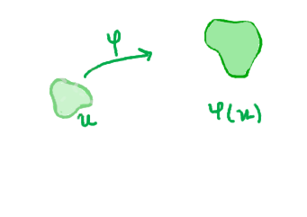
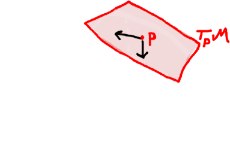
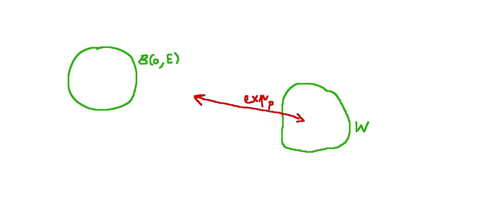
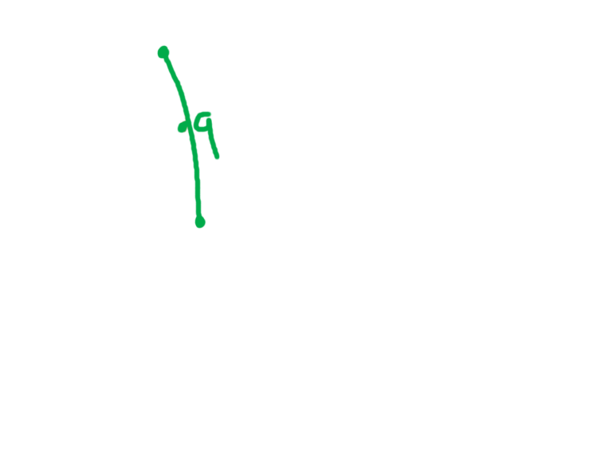

## Manifolds

The paradigm of differential geometry is we should not think of shapes as always sitting inside a fixed Euclidean space, but rather as a **space of its own**. 
In this perspective, we shall recall before anything the definition of a **manifold**. \
A manifold $(\mathcal{M}, T, \mathcal{A})$ of dimension $n$ corresponds to a **topological space** all together with a **set of charts** called *atlas* and denoted by $\mathcal{A} = (\mathcal{U}, \varphi)$, that can individually be continuously be mapped into an open subspace of $\mathbb{R}^n$ (respectively, this subspace can be mapped back into the original set i.e. we have a **homeomorphism** $\varphi$ from $\mathcal{U}$ to $\mathbb{R}^n$).\
In other words, a manifold is a topological space that locally resembles to the euclidian space in a tightened neighborhood (e.g. the Earth is a spherical surface, but may have local flattened representations). On the figure above, we present a potatoe-shaped 2D manifold with one chart depicted in green.

When we talk of charts, precisely, we are talking of a neighborhood of a point, with a certain size. The union of all of the charts form the atlas $\mathcal{A}$, and corresponds exactly to the original manifold $\mathcal{M}$. It is possible that one point may be included in two differents charts, which would mean that the intersection of two charts is non null. In that case, we can define what we call a *transition function*, or a *transition map* from the image of the intersection of the two charts with respects to $\varphi_\alpha$, to the image of this intersection wrt $\varphi_\beta$. More precisely, this transition map is defined on the composition of one chart and the inverse of the other : $\tau_{\alpha, \beta} = \varphi_\beta \circ \varphi_\alpha^{-1}$. Being a composition of two homeomorphisms, the transition map is also a homeomorphism.

## Tangent Space and tangent bundle

The idea dehind tangent spaces is the definition of a $n$-dimensionnal vector space attached to each point of the manifold which has the same dimension.
Considering a manifold $\mathcal{M}$ of dimension $d$, we begin by chosing a point $p \in \mathcal{M}$. Now, let's consider the set of all smooth curves in $\mathcal{M}$ that passes through $p$ denoted by  $\mathcal{C}_p^\infty(\mathcal{M})$. Since each curve is paratrized, we can take the parameter derivative which produces the velocity at each point. To produce the tangeant vectors at a point, we need to take the derivative of all of the smooth curves at this point. The ***tangeant space $T_pM$*** is a vector space of the same dimension as the manifold.\
The notion of tangent spaces isn't exclusive to manifolds : in fact, tangent spaces also exists in Euclidean space, and they have the feature of begin *naturally* isomorphic between each others.

From now on, we define the ***tangent bundle TM*** of a manifold, which corresponds to the sum of every tangent spaces at each point of the manifold. In fact, it appears that $TM$ is also a $C^\infty$ manifold (of dimension 4), and each element of $TM$ is a couple $(p, v)$ where $p$ is a point in $\mathcal{M}$ and $v$ is a tangent vector of $\mathcal{M}$ at $p$.\
The whole point of using tangent bundles in differential geometry is that it will allow us to reduce the local study of the geodesics on $\mathcal{M}$ to the study of trajectories on a vector field (the *geodesic field*) on $TM$.

## Riemanian manifold

A Riemanian manifold is a differentiable manifold together with a given Riemanian metric. 
A Riemannian metric (p 38) on a manifold associates to each point of M an inner product $\Phi$ on the tengeant space on that point. 

The whole point of using Riemannian manifolds is that as the tangeant space at each point is a Euclidean space with a defined inner product, this opens the way to a the study of manifolds from a geometric point of view, allowing us us to define a lot of notions like distance, length, angles and curvature. The notion of angle between two curves for example, can be defined as the angle between their tangent vectors at their intersection point. We can also define the notion of length of a curve based on the integral of the inner product of its tangent vectors at each point [2] : 
$$\mathcal{L} = \int_a^b\sqrt{\Phi(\frac{dp}{dt}, \frac{dp}{dt})}dt$$

where $t$  is an affine function of the arc-length.

## Geodesics

Considering a Riemannian manifold $\mathcal{M}$, the concept of *length* makes sense of any piecewise smooth curve on $\mathcal{M}$. Then, we introduce one of the fundamental concepts of Riemannian geometry, known as geodesics. Simply said, a geodesic generalizes the notion of a straight line in the euclidian space to manifolds, and locally yields the shortest distance between two points. In addition, the shortest path between two points in general is always a geodesic. A nice and intuitive example is that the geodesics of a sphere corresponds to its great circles parametrized by arc length.\
One thing to know is that a curve living on a manifold has not only one but many derivatives, as it may bend along multiple directions. Hence, we introduce the notion of ***covariant derivative***, which - simply said - shall recall the derivative of a tengeant vector $V$ *from the viewpoint of $S$*. The covariant derivative is usually denoted by $\frac{D\gamma}{dt}$. The major point for a curve to be geodesic is that it should be parametrized with constant speed, in other words, its covariant derivative should always be equal to zero. 

## Flow and geodesic flow

The notion of flow lies on a the preleiminary notion of *trajectory* (or *integral curve*) defined as follows :

> **Definition** ([3], definition 8.6, p.504) : Let $X$ be a vector field on $\mathcal{M}$, and let $p \in \mathcal{M}$. Set $\delta > 0$. A trajectory (or integral curvature) for $X$ with initial condition $p$ is a curve $\gamma: I \rightarrow \mathcal{M}$ so that 
> $$ \forall t \in (-\delta, \delta), \gamma'(t) = X_{\gamma(t)}  \text{, and } \gamma(0) = p$$

With this definition, we know that first of all, a trajectory for $X$ with initial condition $p$ is a curve $\gamma$ that passes through $p$ at time $t = 0$, and that for every $q \in \gamma$ the tangent vector to this curve at $q$ coincides with the value of the vector field $X$ at $p$. 

> **Theorem** ([1], theorem 2.2, p.63) : Let $X$ be a vector field on $\mathcal{M}$. Then, there exists an open set $V \subset \mathcal{M}$ containing a point $p$, a number $\delta > 0$ and a $C^\infty$ mapping $\varphi: (-\delta, \delta) \times V_0 \rightarrow \mathcal{M}$ such that for every $q \in V$ the curve the curve $t \rightarrow \varphi(t, q)$ is the unique trajectory of $X$ with initial condition $q$. The map $\varphi$ is called a local flow for $X$ at $p$.

Simply said, the flow of a vector field $X$ defined in some open set $V \subset \mathcal{M}$ is a map that takes a certain $t$ from a time interval $(-\delta, \delta)$ and a point $p$ from some subset of $\mathcal{M}$, and travels along $\mathcal{M}$ for a $t$ unit of time following a unique trajectory.

> Lemma ([1], lemma 2.3, p.63) : There exists a unique vector field $G$ on $TM$ whose trajectories are of the form $t \rightarrow (\gamma(t), \gamma'(t))$ where $\gamma$ is a geodesic on $\mathcal{M}$. $G$ is called the geodesic field on $TM$ and its flow is called the geodesic flow.

## Exponential maps

The main idea behind the exponential map is to parametrize a Riemannian manifold **locally** near any point thanks to geodesics, in terms of a map from $T_pM$ to the manifold.

More precisely, let $v$ be a tangeant vector to $\mathcal{M}$ at $p$. Then, there exists a unique geodesic satisfying $\gamma_v(0) = p$ with $\gamma_v'(0) = v$. The corresponding exponential $\exp_p$ map is defined by $\exp_p(v) = \gamma_v(1)$. In other words, the exponential map takes a given tangent vector (living in the tangeant space $T_pM$) and runs along the corresponding geodesic for one unit time, giving us a point on the manifold $\mathcal{M}$.

Denoting $D(p)$ the set of vectors of $T_pM$ such that the exponential map is defined, it is appearent that $D(p)$ is star shaped with respect to a certain $w$, in other words, that each point of $D(p)$ can be connected to $w$ with a straight line in $T_pM$. In the case where $D(p) = T_pM$ for all point in the manifold, the manifold is said to be ***geodesically complete***.

[1] has a nice illustration of the notion of exponential maps on page 337.

## Gauss lemma

> **Gauss lemma** ([2] lemma 7.3, p.344) : Let $p \in B$ and suppose $\exp_p$ maps the open $\epsilon$-ball of $T_pM$ diffeomorphically onto $N_p \supset B$. Then, the geodesics through $p$ are orthogonal to the geodesic spheres $S_r$ defined by $S_r = \{\exp_p v \; \vert \; \lVert v\rVert = r\}, v \in T_pM, r < \epsilon$.

This lemma asserts that any sufficiently small sphere of $T_pM$ under the exponential map is orthogonal to every geodesics that goes through $p$.

> **Gauss lemma** ([1] lemma 3.5, p.69) : Let $p \in \mathcal{M}$ and let $v \in T_pM$ such that $\exp_p(v)$ is defined. Let $w \in T_pM \approx T_v(T_pM)$. Then 
> $$\langle(d\exp_p)_v(v), (d\exp_p)_v(w)\rangle = \langle v, w\rangle$$

????

## Normal neighborhood

Riemannian geometry introduces the notion of ***normal neighborhood*** $W$ of a point : given a fixed $\delta > 0$, for all $a, b \in W$, there exists a (minimal) geodesic $\gamma$ joining $a$ and $b$ with length inferior than $\delta$.\
Another definition is that considering a point $p \in \mathcal{M}$ and the open ball $B(0, \epsilon) \subset T_pM$, the normal neighborhood $W$ is defined as the diffeomorphic image under $\exp_p$ of $B(0, \epsilon)$ (see figure above). Moreover, we call $\exp_q B(0, \epsilon) = B(p, \epsilon)$ the ***normal ball*** (or ***geosedic ball***) with center $q$ and radius $\epsilon$ that lives *within* the manifold and not the ambiant space. It is therefore formed with the geodesic distance rather than the euclidean one.

> **Normal neighborhood Theorem** [2, p.339] : Every point $q$ of a Riemannian manifold $\mathcal{M}$ has a neighborhood $W$ which is the diffeomorphic image under $\exp_q$ of a star-shaped neighborhood $\~W$ of the zero vector $0_q$ of $T_qM$.

This theorem ensures the existence of a normal neighbordhood for each point of a riemannian manifold. However, there is no guarantee each point in $W$ can be joined by a $\gamma$ entierely included in $W$. Hence we introduce the notion of ***strong connexity*** : that ensure that for each pair of points of a subset $S$ of $M$ there exists a unique geodesic joining those two points with an interior contained in $S$. In [1], it is proven that for a certain radius $\beta > 0$ the totally normal ball $B(p, \beta)$ is strongly convex.

> **lemma** : For any $p \in M$ there exists a $c > 0$ such that any geodesic in $M$ that is tangeant to any geodesic sphere $S(p, r)$ of radius $r < c$ at point $q$ is out of the geodesic ball $B(p, r)$.

In other words, this means that there exists a specific "border" such that if any geodesic $\gamma$ crosses that border, this means that the tangent point $q$ of $\gamma$ to $B(p, r)$ if the closest to $p$.

> **proof** : Let $p$ be the point from the lemma, and let W be its totally normal neighborhood. Let's suppose that all the geodesics on $W$ have velocity one, so we can restrict ourselves to the unit tangent bundle $T_1W$ which corresponds to the set of **all tangent vectors of $W$ with  velocity one** : 
> $$T_1W = \{(q, v); q \in W, v \in T_pM, \lvert v\rvert = 1\}$$
> Let $\gamma: I \times T_1W \rightarrow \mathcal{M}$ with $I = (-\epsilon, \epsilon)$ be the differentiable mapping such that $t \rightarrow \gamma(t, q, v)$ is the geodesic that at the instant $t = 0$ passes through $q$ with velocity $v$, $\lvert v \rvert = 1$. In other words, $\gamma$ maps back the vectors of $T_1W$ that starts at $q$ to $\mathcal{M}$.
Define $u(t, q, v) = \exp_p^{-1}(\gamma(t, q, v))$ and 
$$F : I \times T_1W \rightarrow R, \; F(t, q, v) = \lvert u(t, q, v)\rvert^2$$
$F$ measures the square of the "distance" from $p$ to a point that is moving along the geodesic $\gamma$.

> **proposition** : For any $p \in M$ there exists a $\beta > 0$ such that the geodesic ball $B(p, \beta)$ is strongly convex.

____

## References

[1] Manfredo Perdigao Do Carmo, "Riemannian Geometry" in *Mathematics: Theory & Applications*, Birkhauser 1992\
[2] William M. Boothby, "An introduction to differentiable manifolds and riemannian geometry" in *Pure and applied Mathematics*, Nachdr, 1993\
[3] University of Pennsylvania course on Differential Geometry by Jean Gallier, chapter 8, 13 https://www.cis.upenn.edu/~cis6100/cis6100-notes-23.html