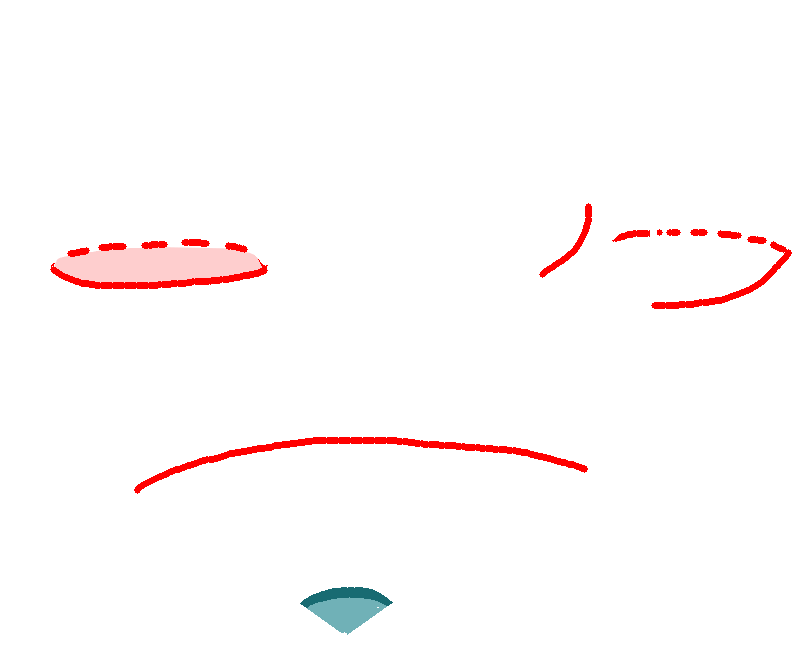
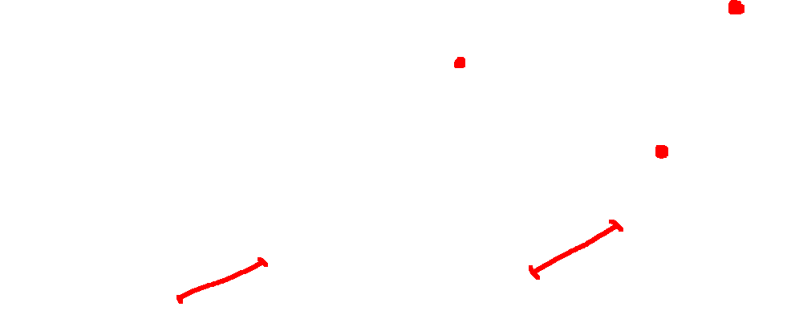
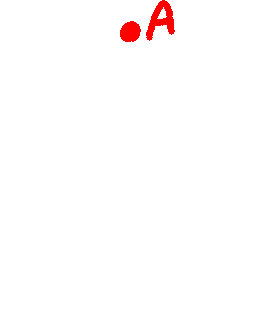

# preliminary notions

## Surface

A surface is a figure (a set of points) in three dimensional Euclidean space that has the following properties : 

- 1 : each of its points has a neighborhoos homeomorphic to a disk
- 2 : each of its two points can be connected by a continuous curve

Any continuous image of a segment is called a continuous curve.

## Polyhedrons study

"any surface can be approximated by a polyhedron with any accuracy. In particular, a closed convex surface can be approximated by closed convex polyhedra."

For each point of a polyhedron, there exists a neighborhood (that is homeomorphic to a disk) belonging only to a finite number of faces.
We have three types of points : 
- on a face
- on an edge
- on a vertex

A neighborhood of a point that lies in the interior of some edge is a piece of a dihedral angle. 

"A neighborhood of a vertex A is obtained if we take all points of the polyhedron that are at a distance less than a given r > 0 from A; moreover, r can be taken so small that the so-obtained neighborhood contains no vertices but A"

A polyhedron is characterized by the property that the sum of the angles meeting at each of its vertices is laways less than $2\pi$.

> *A metric space is locally isometric to a convex polyhedron if and only if for each point of this space there exists a neighborhood isometric to a cone whose complete angle at the vertex is less than or equal to 2π. Obviously, the angle equal to 2π relates to the points other than vertices*

## Doubly covered

-> shapes are doubly covered means that we assume the the points on their upper and lower sides are different even if these points coincide.

## Cone and complete angle

A cone $\mathcal{C}$ is formed by rays going from the center of some sphere to any closed rectifiable curve which form the base of the cone. We define the directix in red on the figure below as the locus of the apex of the cone in $\mathcal{C}$. If we cut $\mathcal{C}$ along its ruling, the cone covers a certain angle on the place (which can be > $2\pi$ if the cone is really large), called *complete angle*. It is displayed in blue on the figure.

# Ch. 1 pt. 10

The essence of this section is the visualization of the differences between the intrinsic geometry of arbitrary convex surfaces and regular convex ones.

Nice properties of **shortes arcs** on convex surfaces* (cf p. 46-47):

- On a convex surface $S$, each point has a neighborhood whose every pair of points can be connected by a shortest arc. If $S$ happens to be *complete***, then this neighborhood corresponds to the whole surface. 
- A shortest arc is homeomorphic to a line segment. Each arc of a shortest arc is also a shortest arc. The length of a shortest arc is equal to the distance between its ends.

- Only one shortest arc can emanate from a given point in a given direction, or, in other words, two tangent shortest arcs overlap.

- Two shortest arcs either have zero (**case A**), one (**case B**) or two common points (**case C**). In the latter case, those two common points turn to be their common endpoints (likewise two great half circles on the sphere connecting two diametrically antipodal points).
- Two shortest arcs can overlap on a whole segment, so that one of these shortest arcs is a part of the other (**case D**) OR so that one endpoint of their common segment (or the point that is the endpoint of one of these arcs and the other endpoint of this segment) is the endpoint of the other shortest arc (case E) (likewise two overlapping arcs of great circle).

- The five cases detailed above are the only possible arrangements for two shortest arcs.
- The limit of shortest arc is a shortest arc, i.e. is shortest arcs converge to some curve, this curve is also a shortest arc.

---

*a **convex surface** is any subset of the boundary of a convex body i.e. a closed set $S$ on which each point can be joinded by a segment contained in $S$ (cf. p.3)\
**a **complete convex surface** is the whole boundary of a convex body.

---

Main **singularities** of shortest arcs with examples (cf. p.47) :

- 1 : There can be pairs of points on a convexe surface which can be connected not to one but many shortest arcs; such points can be even arbitrarily close to each others (e.g. antipodal points lying on a symmetry axis of a symmetrical object)

- 2 : There can be points from which no shortest arcs emanate in certain directions

- 3 : There can be points such that no shortest arc passes through them (e.g. cone)

- 4 : If we connect a given point $a$ with a variable point $x$ by a shortest arc, the shortest arc $ax$ can vary discontinuously while the point $x$ moves continuously.

-> Singularities 2 and 3 imply that a geodesic line on a convex surface may fail to admit an infinite prolongation as in the case of regular surfaces.\
-> For singularities 1, 3 and 4, we can take the example of the cone with complete angle < $2\pi$. Let's denote it $C$. Set $a$ and $b$ two points on the lateral surface of $C$ such that $a$ and $b$ are different from the vertex $o$ of the cone. If we cut the cone along $oa$ and $ob$ we shall obtain two unfoldable sectors. The sector with the shortest angle contains the shortest araac $ab$ that corresopnds to the line segment $ab$ drawn in this unfolded sector. From this, no shortest arc can pass through the vertex $o$, which illustrates the case 3. Moreover, if both sectors are equal then the segments $ab$ in both of those sectors are also equal. In this case, we have $a$ and $b$ arbitrarily close to $o$ connected by two shortest arcs, which illustrates case 1.\
-> To illustrate the case 4, consider the circle centered at the vertex $o$ and passing through a point $a$. We construct the point $b$ by moving along this circle strating from $a$. While $b$ doesn't travel half of the circle, the shortest arc between $a$ and $b$ varies continuously. But when $b$ crosses half of the circle, we have a jump of the shorest arc from one side of the cone to the other, so we have a discontinuation of the shortest arc $ab$ while $b$ moves continuously.

As we saw that with the example of the cone, an interesting property is that there are no shortest arcs passing through a conical point of a convex surface (i.e. a point with complete angle* < $2\pi$). What is even more interesting is that this property may also extend to some noncritial points.

For example, let $G$ be a convex domain on the plane, and let $L$ be the curve bounding this domain. If the curvature of the curve *L* is infinite at a certain point $A$, then there are no shortest arcs passing through $a$ on the doubly covered domain $G$.

But in this example, $A$ still lies on an edge of the surface. In fact, this property also holds for points at which there is a tangent plane.
The proof of the proposition above relies on the recursive construction of a conical-like surface such that its pole has a tengent plane and since the pole section is a a cone, then no shortest arc passes through its pole.

There are no shortest arcs on a cone of revolution that touch the base circle, same for the cylinder.

But still, all  those surfaces are non smooth. 

# Ch. 2 pt 3 : Nonoverlapping condition for shortest arcs

If two shortest arcs AB and AC coincide on some segment AD, on of them is included in the other. 

-> Two different shortest arcs emanating from the same point can overlap on no segment.

# Ch. 2 pt 4